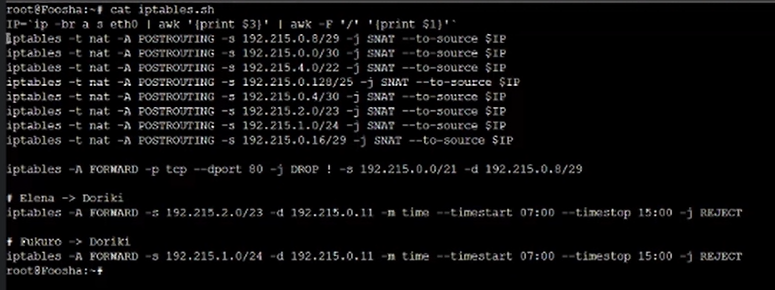
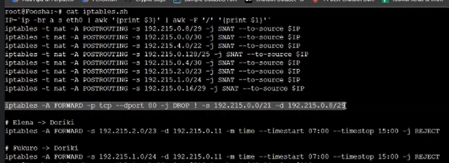
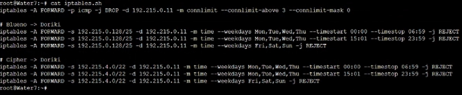

# Jarkom-Modul-5-T08-2021

Laporan Resmi Praktikum Jarkom Modul 5

Disusun oleh :
* Clarissa Fatimah (05311940000012)
* Alessandro Tionardo (05311940000018)
* Christoper Adrian Kusuma (05311940000022)

---
### Topologi


```
Keterangan : 	

Doriki adalah DNS Server
Jipangu adalah DHCP Server
Maingate dan Jorge adalah Web Server
Jumlah Host pada Blueno adalah 100 host
Jumlah Host pada Cipher adalah 700 host
Jumlah Host pada Elena adalah 300 host
Jumlah Host pada Fukurou adalah 200 host
```


Karena kalian telah belajar subnetting dan routing, Luffy ingin meminta kalian untuk membuat topologi tersebut menggunakan teknik CIDR atau VLSM. setelah melakukan subnetting, Kalian juga diharuskan melakukan Routing agar setiap perangkat pada jaringan tersebut dapat terhubung.


menghitung pembagian IP berdasarkan NID dan netmask seperti gambar. Kemudian dilakukan subnetting untuk pembagian IP sesuai subnet yang ada.


tabel subnet dapat dilihat pada tabel berikut.


Kami dapatkan hasil perhitungan Network ID, Netmask, Broadcast Address dari semua subnet pada tabel berikut.


# Soal 

## 1. Agar topologi yang kalian buat dapat mengakses keluar, kalian diminta untuk mengkonfigurasi Foosha menggunakan iptables, tetapi Luffy tidak ingin menggunakan MASQUERADE.

## pada foosha
```
IP=`ip -br a s eth0 | awk '{print $3}' | awk -F '/' '{print $1}'`
iptables -t nat -A POSTROUTING -s 192.215.0.8/29 -j SNAT --to-source $IP
iptables -t nat -A POSTROUTING -s 192.215.0.0/30 -j SNAT --to-source $IP
iptables -t nat -A POSTROUTING -s 192.215.4.0/22 -j SNAT --to-source $IP
iptables -t nat -A POSTROUTING -s 192.215.0.128/25 -j SNAT --to-source $IP
iptables -t nat -A POSTROUTING -s 192.215.0.4/30 -j SNAT --to-source $IP
iptables -t nat -A POSTROUTING -s 192.215.2.0/23 -j SNAT --to-source $IP
iptables -t nat -A POSTROUTING -s 192.215.1.0/24 -j SNAT --to-source $IP
iptables -t nat -A POSTROUTING -s 192.215.0.16/29 -j SNAT --to-source $IP
```

pertama-tama mengatur tabel NAT untuk postrouting, lalu menentukan asal subnetnya. source IP nya foosha di eth0.


lalu dilakukan ping 


## 2. Kalian diminta untuk mendrop semua akses HTTP dari luar Topologi kalian pada server yang merupakan DHCP Server dan DNS Server demi menjaga keamanan.

pada foosha
```
iptables -A FORWARD -p tcp --dport 80 -j DROP ! -s 192.215.0.0/21 -d 192.215.0.8/29
```


DHCP dan DNS Server terdapat pada IP 192.215.0.8/29. Sehingga destinasinya ke -d 192.215.0.8/29 namun sumbernya bukan dari total subnet kita, melainkan 192.215.0.0/21. Dimana nantinya akan di DROP, karena itu httpnya, berarti detinasi portnya 80 dan protokolnya DHCP

## 3. Karena kelompok kalian maksimal terdiri dari 3 orang. Luffy meminta kalian untuk membatasi DHCP dan DNS Server hanya boleh menerima maksimal 3 koneksi ICMP secara bersamaan menggunakan iptables, selebihnya didrop.

membuat iptables di water7
```
iptables -A FORWARD -p icmp -j DROP -d 192.215.0.11 -m connlimit --connlimit-above 3 --connlimit-mask 0
```


menggunakan -p icmp agar protokol ICMP atau ping yang masuk agar dibatasi -m connlimit --connlimit-above 3 hanya sebatas maksimal 3 koneksi saja --connlimit-mask 0 darimana saja, sehingga lebih dari itu akan -j DROP di DROP.

## 4. Akses dari subnet Blueno dan Cipher hanya diperbolehkan pada pukul 07.00 - 15.00 pada hari Senin sampai Kamis.[membatasi akses ke Doriki]

pada Water7
```
# Blueno -> Doriki
iptables -A FORWARD -s 192.215.0.128/25 -d 192.215.0.11 -m time --weekdays Mon,Tue,Wed,Thu --timestart 00:00 --timestop 06:59 -j REJECT
iptables -A FORWARD -s 192.215.0.128/25 -d 192.215.0.11 -m time --weekdays Mon,Tue,Wed,Thu --timestart 15:01 --timestop 23:59 -j REJECT
iptables -A FORWARD -s 192.215.0.128/25 -d 192.215.0.11 -m time --weekdays Fri,Sat,Sun -j REJECT

# Cipher -> Doriki
iptables -A FORWARD -s 192.215.4.0/22 -d 192.215.0.11 -m time --weekdays Mon,Tue,Wed,Thu --timestart 00:00 --timestop 06:59 -j REJECT
iptables -A FORWARD -s 192.215.4.0/22 -d 192.215.0.11 -m time --weekdays Mon,Tue,Wed,Thu --timestart 15:01 --timestop 23:59 -j REJECT
iptables -A FORWARD -s 192.215.4.0/22 -d 192.215.0.11 -m time --weekdays Fri,Sat,Sun -j REJECT
```
Kita menggunakan iptables `-A FOWARD` foward chain pada router water7 untuk menyaring paket dari blueno dan cipher yang melewati router Water7 menuju ke Doriki agar ditolak dan diberikan error message jika berada pada waktu diluar pukul 07.00-15.00 pada hari senin sampai kamis.

**Blueno[success]**


**Blueno[error]**


**Cipher[success]**


**Cipher[error]**


## 5. Akses dari subnet Elena dan Fukuro hanya diperbolehkan pada pukul 15.01 hingga pukul 06.59 setiap harinya.[membatasi akses ke Doriki]

pada Foosha

```
# Elena -> Doriki
iptables -A FORWARD -s 192.215.2.0/23 -d 192.215.0.11 -m time --timestart 07:00 --timestop 15:00 -j REJECT

# Fukuro -> Doriki
iptables -A FORWARD -s 192.215.1.0/24 -d 192.215.0.11 -m time --timestart 07:00 --timestop 15:00 -j REJECT
```

Kita menggunakan iptables `-A FOWARD` foward chain pada router Foosha untuk menyaring paket dari Elena dan Fukuro yang melewati router Foosha menuju ke Doriki agar ditolak dan diberikan error message jika berada pada waktu diluar pukul 15.01 hingga pukul 06.59 setiap harinya.

**Elena[success]**


**Elena[error]**


**Fukurou[success]**


**Fukurou[error]**


## 6. Karena kita memiliki 2 Web Server, Luffy ingin Guanhao disetting sehingga setiap request dari client yang mengakses DNS Server akan didistribusikan secara bergantian pada Jorge dan Maingate

pada Guanhao

```
iptables -t nat -A PREROUTING -p tcp -d 192.215.0.11 -m statistic --mode nth --every 2 --packet 0 -j DNAT --to-destination 192.215.0.18:80
iptables -t nat -A PREROUTING -p tcp -d 192.215.0.11 -m statistic --mode nth --every 1 --packet 0 -j DNAT --to-destination 192.215.0.19:80
```

Pada kasus ini kita menggunakan solusi Load Balancing untuk mendistribusikan koneksi. Untuk mengatasi masalah ini, kita menggunakan `-A PREROUTING` PREROUTING chain pada  `-t nat` NAT table untuk mengubah destination IP yang awalnya menuju ke 192.215.0.11 DNS Server Doriki menjadi ke 192.215.0.19/29  Server Jorge port 80 dan 192.215.0.18/29 Server Maingate port 80. Iptables ini juga menyertakan salah satu modul yang ada dalam aturan Load Balancing yaitu -m statistic modul statistik.

**Pada Elena**


