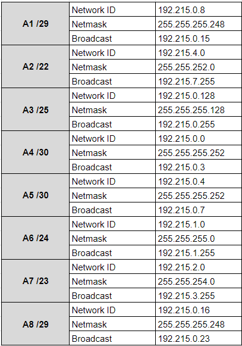

# Jarkom-Modul-5-T08-2021

Laporan Resmi Praktikum Jarkom Modul 5

Disusun oleh :
* Clarissa Fatimah (05311940000012)
* Alessandro Tionardo (05311940000018)
* Christoper Adrian Kusuma (05311940000022)

---
### Topologi


```
Keterangan : 	

Doriki adalah DNS Server
Jipangu adalah DHCP Server
Maingate dan Jorge adalah Web Server
Jumlah Host pada Blueno adalah 100 host
Jumlah Host pada Cipher adalah 700 host
Jumlah Host pada Elena adalah 300 host
Jumlah Host pada Fukurou adalah 200 host
```


Karena kalian telah belajar subnetting dan routing, Luffy ingin meminta kalian untuk membuat topologi tersebut menggunakan teknik CIDR atau VLSM. setelah melakukan subnetting, Kalian juga diharuskan melakukan Routing agar setiap perangkat pada jaringan tersebut dapat terhubung.


menghitung pembagian IP berdasarkan NID dan netmask seperti gambar. Kemudian dilakukan subnetting untuk pembagian IP sesuai subnet yang ada.


tabel subnet dapat dilihat pada tabel berikut.


Kami dapatkan hasil perhitungan Network ID, Netmask, Broadcast Address dari semua subnet pada tabel berikut.



## Soal 1

1. Agar topologi yang kalian buat dapat mengakses keluar, kalian diminta untuk mengkonfigurasi Foosha menggunakan iptables, tetapi Luffy tidak ingin menggunakan MASQUERADE.

### foosha 

konfigurasi foosha
```
auto eth0
iface eth0 inet dhcp

auto eth1
iface eth1 inet static
	address 192.215.0.1
	netmask 255.255.255.252
	broadcast 192.215.0.3

auto eth2
iface eth2 inet static
	address 192.215.0.5
	netmask 255.255.255.252
	broadcast 192.215.0.7
```


2. Kalian diminta untuk mendrop semua akses HTTP dari luar Topologi kalian pada server yang merupakan DHCP Server dan DNS Server demi menjaga keamanan.

pada foosha
```
iptables -A FORWARD -d 192.215.0.16/29 -i eth0 -p tcp -m tcp --dport 80 -j DROP
```

Menggunakan -A FORWARD FORWARD chain untuk menyaring paket dengan -p tcp -m tcp protokol TCP dari luar topologi menuju ke DHCP Server JIPANGU dan DNS Server DORIKI dengan menggunakan subnet yang sama, dimana akses SSH (yang memiliki --dport 80 port 80) yang masuk ke DHCP Server JIPANGU dan DNS Server DORIKI melalui -i eth0 interfaces eth0 dari DHCP Server JIPANGU dan DNS Server DORIKI agar -j DROP di DROP

3. Karena kelompok kalian maksimal terdiri dari 3 orang. Luffy meminta kalian untuk membatasi DHCP dan DNS Server hanya boleh menerima maksimal 3 koneksi ICMP secara bersamaan menggunakan iptables, selebihnya didrop.

pada jipangu 
```
iptables -A INPUT -p icmp -m connlimit --connlimit-above 3 --connlimit-mask 0 -j DROP
```
pada doriki
```
iptables -A INPUT -p icmp -m connlimit --connlimit-above 3 --connlimit-mask 0 -j DROP
```

menggunakan -A INPUT INPUT chain untuk menyaring paket dengan -p icmp agar protokol ICMP atau ping yang masuk agar dibatasi -m connlimit --connlimit-above 3 hanya sebatas maksimal 3 koneksi saja --connlimit-mask 0 darimana saja, sehingga lebih dari itu akan -j DROP di DROP